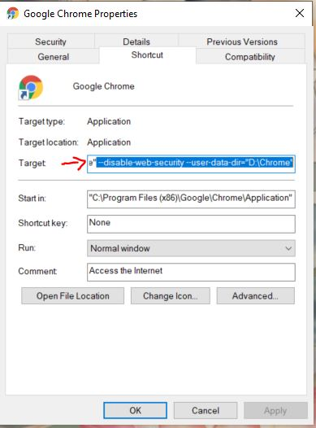

# ENGEO_test

### Video demo: 

### Disable CORS in Browser:
Add these flags to Google Chrome. Right click shortcut, click Properties, append *--disable-web-security --user-data-dir="D:\Chrome"* to Target.

